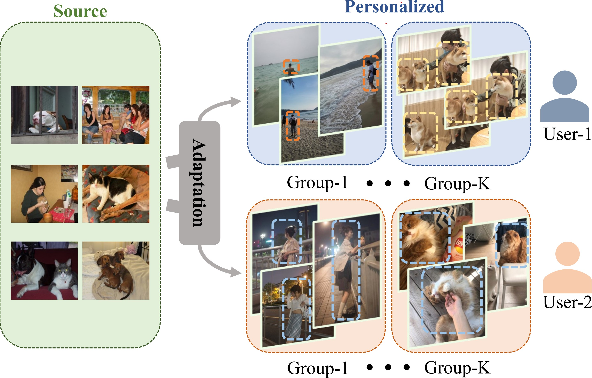

# PSS: Personalized Image Semantic Segmentation


## Paper


[PSS: Personalized Image Semantic Segmentation](https://arxiv.org/abs/2107.13978)  
 Yu Zhang, Chang-Bin Zhang, Peng-Tao Jiang, Ming-Ming Cheng, Feng Mao.
 International Conference on Computer Vision (ICCV), 2021

If you find this code useful for your research, please cite our paper:

```
@inproceedings{zhang2021pss,
  title={Personalized Image Semantic Segmentation},
  author={Yu, Zhang and Chang-Bin, Zhang and Peng-Tao, Jiang and Ming-Ming, Cheng and Feng, Mao},
  booktitle={ICCV},
  year={2021}
}
```

## Abstract
Semantic segmentation models trained on public datasets have achieved great success in recent years. However, these models didn't consider the personalization issue of segmentation though it is important in practice. In this paper, we address the problem of personalized image segmentation. The objective is to generate more accurate segmentation results on unlabeled personalized images by investigating the data's personalized traits. To open up future research in this area, we collect a large dataset containing various users' personalized images called PIS (Personalized Image Semantic Segmentation). We also survey some recent researches related to this problem and report their performance on our dataset. Furthermore, by observing the correlation among a user's personalized images, we propose a baseline method that incorporates the inter-image context when segmenting certain images. Extensive experiments show that our method outperforms the existing methods on the proposed dataset. The code and the PIS dataset will be made publicly available.

## Test code
### Preparation
Our code is built based on [ADVENT](https://github.com/valeoai/ADVENT).
So after clone our repo,
you need to install advent(https://github.com/valeoai/ADVENT):
```bash
$ conda install -c menpo opencv  # install opencv
$ pip install -e <root_dir>  # install advent
```

Make a new directory to put datasets and results:
```bash
makedir ./data
```

#### Dataset
You shold download our [PSS dataset]() and put them under `./data/personal`.  

#### Dataset License: 
Our dataset is made available only for academic research. 
Although we have obtained the personalized photos' copyright, 
the user's privacy is still important.
If you want to get access to our data, please send me a request 
from your school or company email.
The request should include the purpose of using our dataset.
Thank you for your understanding.


#### Pre-trained models
Our pretrained models can be downloaded [here]().
We provide the step2 models that finetuned with pseudo labels, which are
reported as `OURS-S2` in the paper.
Download and put them under `./data/final_res50_step2`.

The directory structure should be like 
```
./data/personal/
               id1
               id2
               ...
               id15
      /final_res50_step2/
                         id1.pth
                         id2.pth
                         ...
                         id15.pth
```
after preparing dataset and pretrained models.

### Run test
Run:
```bash
bash ./PSS_test.sh
```
Then you should get the segmentation results of different users' images under 
`./data/final_res50_step2`.
The test codes inference all 15 ID's results at a time.
If you only want to test on certain user ID, you can modify
line153 of script `./test.py`.


## License
PSS code is released under the Creative Commons Attribution-NonCommercial-ShareAlike 4.0 International Public License for NonCommercial use only. Any commercial use should get formal permission first.
